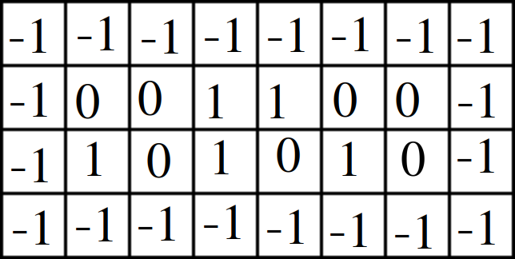
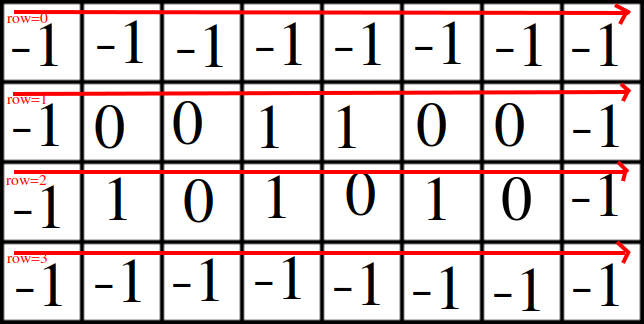
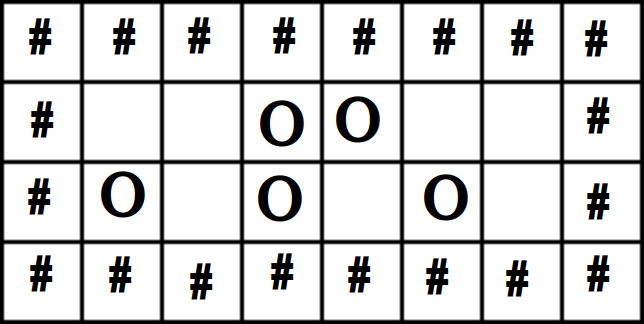
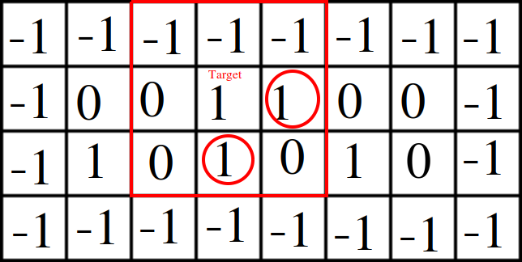

# Functions Explained-

### initGrid(rows, cols, array)

We have already learnt what this function does, but now let's get into the how part.

So, it takes 3 arguments-
1. rows- The number of rows in the 2D matrix
2. cols- The number of rows in the 2D matrix
3. array- which is simply a list which is going to hold the 2D matrix

When we come inside the function there is a **`for`** loop, which ranges from **`(i = 0)`** to **`(i = rows-1)`**, when the first row starts, the control enter the block-

	    for i in range(rows):

Now when it is the first row, there is initialization of a new list, which is empty-

	        arrayRow = []

Now the control enters the inner loop, where this ranges from **`(j = 0)`** to **`(j = cols-1)`**, and for every value of **`i`**, this inner loop executes from **`(j = 0)`** to **`(j = cols-1)`**.

	        for j in range(cols):

Now the control goes inside the the definiton part, if it is the `first row` (i=0) or `first column` (j=0) or 'last row' (rows-1) or the `last column` (cols-1) then the list is appended with (-1) -

	            if (i == 0 or j == 0 or (i == rows - 1) or (j == cols - 1)):
	                arrayRow += [-1]

And now the else part, if values of i & j are anything other than the above specified values, then in the definition part of else, it generates random values from 0 to 3. If the value is 0, then it adds `1` to the row, else if it is any value either `1` or `2` or `3`, it will append 0 to the row.

> Values 1,2,3 are taken just to reduce the probablity of generating 0s.
> Just a note, 0 means a dead cell and 1 mean a live cell.

> randint() is a function in the module random, which generates random numbers
> in a range eg- random.randint(0,3), generates numbers between 0 and 3.

            else:
                ran = random.randint(0,3)
                if ran == 0:
                    arrayRow += [1]
                else:
                    arrayRow += [0]

When the value of `i` is `0` or `row-1` the whole row will be filled with -1.


And for every case values would be somehow like-


And at the end when the first row is to end, the row generated inside the inner loop is appended to the argument list array[].

	        array += [arrayRow]

And after the main loop has run some time, it will appear somehow like the picture below-




---

### printGen(rows, cols, array, genNo):

As per inroduction this function prints the whole 2D matrix. Some let's come to the definition part of this function-

This function clears the screen for the next thing to get printed. The function system("clear") is present in the module `os`.

	    os.system("clear")

> In windows "clear" should be replaced with "cls".

Next statement simply prints the current generation,

> Here is something that is to be noted down that we are trying to concatenate
> a string and a number which is not possible. So we need to **typecast** the
> number into a string e.g- str(number)

	    print("Game of Life -- Generation " + str(genNo + 1))

Now, the control moves to the `for` loop which runs from **`i = 0`** to **`i = rows-1`** and for every  **i**, the inner loop runs from **`j = 0`** to **`j == cols-1`**,

	    for i in range(rows):
	        for j in range(cols):
 


The inner loop contains below statements to be executed. If the list at the `ith` and `jth` position contains-

```
-1, then # will be printed, which represents the boundary
 1, then O will be printed, which represents a live cell
 0, then a space will be printed, which represents a dead cell
```

	            if array[i][j] == -1:
	                print("#", end="")
        	    elif array[i][j] == 1:
                	print("O", end="")
	            else:
        	        print(" ", end="")

Now, after every row has been done printing completely we moved to the next line.

	        print("")


> P.S- Keep a note that we have just printed the 2D matrix and not changed
> the values of the list.

### processNextGen(rows, cols, cur, nxt):

As the name suggests this function processess the 2D matrix for the next generation. `cur` (also referred as current) and `nxt` (also referred as next) are thisGen[] and nextGen[] respectively. 

Coming to the block part, there are again two nested loops, for the first loop value of `i` ranges from **`i = 1`** to **`i = rows-2`** and for each value of `i` the inner loop ranges from **`j = 1`** to **`j = cols - 2`**.

> P.S- As, first and last row **and** first and last column represents
> the boundaries, hence no changes will be there in next generation.

	    for i in range(1,rows-1):
	        for j in range(1,cols-1):

Now for every value of i and j, there is a cell whose existence depends on the surrounding cells, and each need to be processed separately and to achieve that there is a separate function named **processNeighbours()**.

	            nxt[i][j] = processNeighbours(i, j, cur)


---

### processNeighbours(x, y, array):

According to the rules, the existence or birth or death of a cell depends upon the the no. of neighbours a cell has.
So, we need to count the no. of neighbours a cell has. So, we initialized a variable with initial count to be zero i.e `nCount = 0`.

	    nCount = 0

Now comes a for loop for which `j` ranges from **`j = y-1`** to **`j = y+1`** and for each value of `j`, the inner loop ranges from **`i = x-1`** to **`i = x+1`**.

	    for j in range(y-1,y+2):
	        for i in range(x-1,x+2):

And the condition is if **i is not equal to x** and at the same time **j is not equal to y**, i.e we have to neglect the concerned cell, as cell can't be its own neighbour.

	            if not(i == x and j == y):

And at the same time, we should keep in mind that, it may not be a boundary block, so-

	                if array[i][j] != -1:

Then the following statement will be executed-

	                    nCount += array[i][j]

> P.S- If the list at position i & j contains a dead cell i.e array[i][j] = 0
> addition doesn't cause any issue. If array[i][j] = 1 then nCount will be increased by 1.



Now the time for survival/Death-

If the cell is live, and it has neighbours less than 2, then it will die because of loneliness.

	    if array[x][y] == 1 and nCount < 2:
	        return 0


If the cell is live, and it has neighbours greater than 3, then it will die because of overpopulation.

	    if array[x][y] == 1 and nCount > 3:
	        return 0

If the cell is dead, and it has 3 neighbours, then it will take birth according to the rules.

	    if array[x][y] == 0 and nCount == 3:
	        return 1

And if it is none of the above case, then this function will return the same content.

	    else:
	        return array[x][y]

